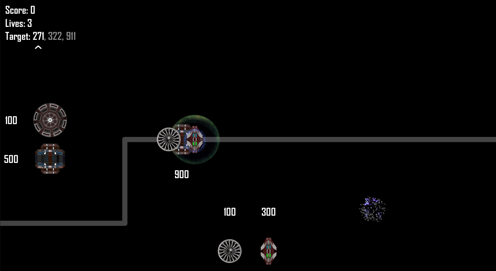
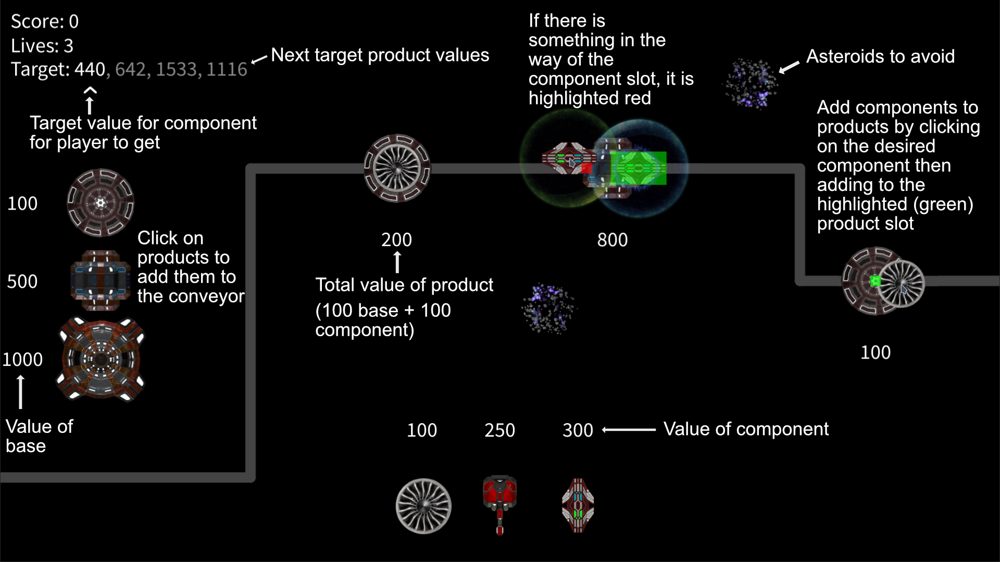

## Project:
This project was a submission for a first year university assignment focused on teaching the basics of
programming using the [Processing 4.0](https://processing.org) library, I then adapted the project from a processing
project into proper Java so I could use it with a proper IDE.

The brief for the project was a 2D product assembly line game which had a series of requirements that had to be
met such as allowing for mouse input, both frame-based animations and just using rotations and other things.

## Screenshots:

## Credits:
 - https://opengameart.org/content/assets-free-space-modular-buildings-kit
 - https://www.seekpng.com/idown/u2w7y3o0q8o0r5q8_carbon-fiber-composite-fan-blades-airplane-engine-fan/
 - https://www.vhv.rs/viewpic/TRxRomh_spr-shield-circle-hd-png-download/
 - https://opengameart.org/content/spark-effect
 - https://opengameart.org/content/shield-spell
 - https://opengameart.org/content/magic-flame
